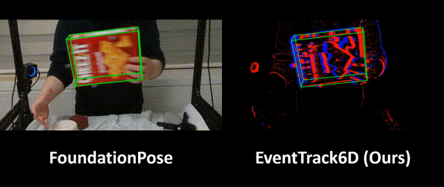

# Event6D: Event-based Novel Object 6D Pose Tracking

[Jae-Young Kang](https://mickeykang16.github.io/)\*, [Hoonehee Cho](https://chohoonhee.github.io/hoonheecho/)\*, [Taeyeop Lee](https://sites.google.com/view/taeyeop-lee/)\*, [Minjun Kang](https://sites.google.com/view/minjun-kang), [Bowen Wen](https://wenbowen123.github.io/), [Youngho Kim](https://scholar.google.com/citations?user=ZDpIMQ0AAAAJ&hl=en), [Kuk-Jin Yoon](https://scholar.google.com/citations?user=1NvBj_gAAAAJ&hl=en)

KAIST &nbsp;|&nbsp; NVIDIA

\* Equal contribution

[]()
[]()



## Changelog🔥

- [2026/03/26] Repository created.

## Cite this work📝

```
@inproceedings{kang2026event6d,
  title     = {Event6D: Event-based Novel Object 6D Pose Tracking},
  author    = {Kang, Jae-Young and
               Cho, Hoonehee and
               Lee, Taeyeop and
               Kang, Minjun and
               Wen, Bowen and
               Kim, Youngho and
               Yoon, Kuk-Jin},
  booktitle = {Proceedings of the IEEE/CVF Conference on Computer Vision and Pattern Recognition (CVPR)},
  year      = {2026}
}
```
