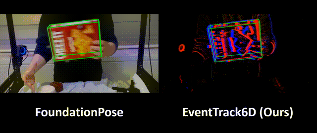

# Event6D: Event-based Novel Object 6D Pose Tracking

[Jae-Young Kang](https://mickeykang16.github.io/)\*, [Hoonehee Cho](https://chohoonhee.github.io/hoonheecho/)\*, [Taeyeop Lee](https://sites.google.com/view/taeyeop-lee/)\*, [Minjun Kang](https://sites.google.com/view/minjun-kang), [Bowen Wen](https://wenbowen123.github.io/), [Youngho Kim](https://scholar.google.com/citations?user=ZDpIMQ0AAAAJ&hl=en), [Kuk-Jin Yoon](https://scholar.google.com/citations?user=1NvBj_gAAAAJ&hl=en)

KAIST &nbsp;|&nbsp; NVIDIA

\* Equal contribution

[]()
[](https://arxiv.org/abs/2603.28045)



## Changelog🔥

- [2026/05] Public release: code, pretrained weights, and two evaluation datasets.
- [2026/03/26] Repository created.

## Setup

```bash
# 1. Clone with submodules
git clone --recurse-submodules https://github.com/mickeykang16/Event6D.git
cd Event6D

# 2. Conda env (PyTorch 2.1.1 + CUDA 11.8)
conda create -n event6d python=3.9 -y
conda activate event6d
pip install -r requirements.txt
pip install --no-cache-dir git+https://github.com/NVlabs/nvdiffrast.git
pip install --no-cache-dir pytorch3d -f https://dl.fbaipublicfiles.com/pytorch3d/packaging/wheels/py39_cu118_pyt211/download.html
pip install -e bop_toolkit

# 3. Build C++/CUDA extensions
bash build_all_conda.sh
```

## Data and weights

All released artifacts are hosted on Hugging Face. Download with `huggingface-cli`:

```bash
# Pretrained checkpoints (≈108 MB)
huggingface-cli download mickeykang/Event6D-weights --local-dir ./weights

# Event6D — real-world capture (≈19 GB)
huggingface-cli download mickeykang/Event6D --repo-type dataset \
    --local-dir ./data/Event6D

# EventHO3D — HO3D-v2 event-augmented evaluation (≈3 GB)
huggingface-cli download mickeykang/EventHO3D --repo-type dataset \
    --local-dir ./data/EventHO3D
```

For HO3D evaluation, also obtain the original [HO3D-v2 evaluation split](https://www.tugraz.at/index.php?id=40231)
and merge it under `./data/EventHO3D/evaluation/`. Place the [YCB-Video models](https://rse-lab.cs.washington.edu/projects/posecnn/)
under `./data/EventHO3D/ycb_models/` (or set `YCB_MODELS_PATH=/path/to/ycb_models`).

After all downloads, the layout should be:

```
Event6D/
├── weights/
│   ├── depth_extrapolation.pth
│   ├── e2vid.pth.tar
│   └── foundationpose_refiner/
│       ├── config.yml
│       └── model.pth
├── data/
│   ├── Event6D/         # real-world capture (eval)
│   ├── EventHO3D/       # HO3D-v2 augmentation (eval) + your HO3D-v2 download
│   └── Event6DBlender/  # synthetic Blender data (Stage 1 training, optional)
├── configs/
│   └── stage1_eventvfi_pretrain.yaml
├── src/
│   ├── depth_extrapolation/   # depth-extrapolation model + Stage 1 datasets
│   ├── e2vid/                 # E2VID upstream (UZH-RPG)
│   ├── refiner/               # FoundationPose refiner (eval-time)
│   └── dataloader/            # eval-time dataloaders
├── run_event6d_tracking.py
├── run_eventho3d_tracking.py
└── train_stage1_pretrain.py
```

## Evaluation

### Event6D (real-world)

```bash
# 120 fps — pose evaluated at each event sub-timestep
CUDA_VISIBLE_DEVICES=0 python3 run_event6d_tracking.py \
    --name event6d_eval_120fps \
    --video_dirs ./data/Event6D \
    --eval_fps 120 --e2vid --online \
    --ev_width 640 --ev_height 360 \
    --depth_extrapolation_ckpt ./weights/depth_extrapolation.pth

# 30 fps — pose evaluated only at RGB instants
CUDA_VISIBLE_DEVICES=0 python3 run_event6d_tracking.py \
    --name event6d_eval_30fps \
    --video_dirs ./data/Event6D \
    --eval_fps 30 --e2vid --online \
    --ev_width 640 --ev_height 360 \
    --depth_extrapolation_ckpt ./weights/depth_extrapolation.pth
```

### EventHO3D (HO3D-v2 + simulated events)

```bash
CUDA_VISIBLE_DEVICES=0 python3 run_eventho3d_tracking.py \
    --name eventho3d_eval \
    --video_dirs ./data/EventHO3D/evaluation \
    --stride 10 --online \
    --depth_extrapolation_ckpt ./weights/depth_extrapolation.pth \
    --e2vid_ckpt ./weights/e2vid.pth.tar
```

### Output

Per-run metrics are written to `outputs/<name>/0_eval_metric/`:
- `<sequence>_*.xlsx` — per-sequence ADDS / ADD / AR / MSSD / MSPD / VSD / IoU
- `0_mean_all.xlsx` — aggregated table; row `ALL` is the dataset-wide mean

> The dataloader caches voxel grids / E2VID inputs on the first run (see
> [Disk-space note](#disk-space-note-event-caches) below). Subsequent runs reuse them.

## Disk-space note (event caches)

The dataloader caches voxel grids alongside the raw events on first use. Expect roughly:

| Where | Approx. extra disk |
|---|---|
| Event6D (eval) | ≈15 GB |
| EventHO3D (eval) | ≈7 GB |
| Event6DBlender (Stage 1 training) | ≈120 GB |

## Training

The released `weights/depth_extrapolation.pth` is produced by a 2-stage recipe:

```
[Blender synthetic data]
       │
       ▼
Stage 1 — EventVFI pretraining
   single-task L1 depth loss on the small depth-extrapolation model
       │ save/<name>/epoch-{N}.pth
       ▼
Stage 2 — End-to-end refinement (coming soon)
   pose + depth + recon (LPIPS) losses jointly, refiner + depth + e2vid
       │
       ▼
   weights/depth_extrapolation.pth
```

### Training data (Blender)

The released `depth_extrapolation.pth` checkpoint was trained on Blender-rendered
sequences with Google Scanned Objects:

```bash
# easy subset (≈255 GB)
huggingface-cli download mickeykang/Event6DBlender --repo-type dataset \
    --local-dir ./data/Event6DBlender

# medium subset (≈483 GB)
huggingface-cli download mickeykang/Event6DBlenderMedium --repo-type dataset \
    --local-dir ./data/Event6DBlender
```

Both downloads merge into a single tree:
- `train.txt` / `test.txt` — split lists
- `gso/` — 1035 GSO meshes (CC-BY 4.0)
- `EvBlenderProc/{easy,medium}_9/` — RGB + depth + meta
- `EvBlenderProcEv/{easy,medium}_9/` — raw event NPZ

Both `easy` and `medium` subsets are used for training (the split is defined by
`train.txt`), so both downloads are required for reproduction.

### Stage 1 — EventVFI pretraining (depth-extrapolation only)

Trains the small (~311 K-param) `cbmnet_light_extrapolation_small_e2vid` depth model on
Blender synthetic depth with L1 supervision; E2VID is held frozen. Single-GPU.

```bash
python train_stage1_pretrain.py \
    --config configs/stage1_eventvfi_pretrain.yaml \
    --name stage1_v1 --gpu 0
```

Checkpoints are saved to `save/stage1_v1/epoch-{N}.pth`. Pass one as `--eventvfi_ckpt`
to Stage 2 (below) when it is released.

### Stage 2 — End-to-end refinement

**Coming soon** — joins refiner + depth-extrapolation + e2vid decoder with pose + depth

## Acknowledgements

```
@inproceedings{wen2024foundationpose,
  title     = {FoundationPose: Unified 6D Pose Estimation and Tracking of Novel Objects},
  author    = {Wen, Bowen and Yang, Wei and Kautz, Jan and Birchfield, Stan},
  booktitle = {Proceedings of the IEEE/CVF Conference on Computer Vision and Pattern Recognition (CVPR)},
  year      = {2024}
}

@article{rebecq2019high,
  title   = {High Speed and High Dynamic Range Video with an Event Camera},
  author  = {Rebecq, Henri and Ranftl, Ren{\'e} and Koltun, Vladlen and Scaramuzza, Davide},
  journal = {IEEE Transactions on Pattern Analysis and Machine Intelligence (T-PAMI)},
  year    = {2019}
}

@inproceedings{kim2023event,
  title     = {Event-based Video Frame Interpolation with Cross-Modal Asymmetric Bidirectional Motion Fields},
  author    = {Kim, Taewoo and Chae, Yujeong and Jang, Hyun-Kurl and Yoon, Kuk-Jin},
  booktitle = {Proceedings of the IEEE/CVF Conference on Computer Vision and Pattern Recognition (CVPR)},
  year      = {2023}
}
```

## Cite this work📝

```
@inproceedings{kang2026event6d,
  title     = {Event6D: Event-based Novel Object 6D Pose Tracking},
  author    = {Kang, Jae-Young and
               Cho, Hoonehee and
               Lee, Taeyeop and
               Kang, Minjun and
               Wen, Bowen and
               Kim, Youngho and
               Yoon, Kuk-Jin},
  booktitle = {Proceedings of the IEEE/CVF Conference on Computer Vision and Pattern Recognition (CVPR)},
  year      = {2026}
}
```
